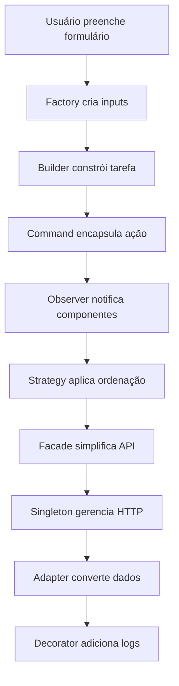

# 🎯 Design Patterns em Nuxt.js - Apresentação Completa

> **Demonstração prática de 9 Design Patterns clássicos implementados em Nuxt 3 + TypeScript**

---

## 📋 **Índice**

- [Visão Geral](#visão-geral)
- [Padrões Criacionais](#-padrões-criacionais)
- [Padrões Estruturais](#-padrões-estruturais)
- [Padrões Comportamentais](#-padrões-comportamentais)
- [Integração dos Padrões](#-integração-dos-padrões)
- [Benefícios da Arquitetura](#-benefícios-da-arquitetura)
- [Conclusão](#-conclusão)

---

## 🎯 **Visão Geral**

Este projeto demonstra a implementação de **9 Design Patterns clássicos** organizados nas três categorias principais:

| Categoria | Padrões | Função Principal |
|-----------|---------|------------------|
| 🏗️ **Criacionais** | Singleton, Builder, Factory | Criação de objetos |
| 🏛️ **Estruturais** | Facade, Adapter, Decorator | Organização de código |
| 🎭 **Comportamentais** | Observer, Strategy, Command | Comunicação e algoritmos |

### **Tecnologias Utilizadas**
- ✅ **Nuxt 3** - Framework Vue.js full-stack
- ✅ **TypeScript** - Tipagem estática
- ✅ **Tailwind CSS** - Estilização
- ✅ **Pinia** - Gerenciamento de estado
- ✅ **Mitt** - Event Bus

---

## 🏗️ **Padrões Criacionais**

### 1️⃣ **Singleton Pattern**
> 📁 **Arquivo:** `plugins/apiClient.ts`

**🎯 O que é:**
O Singleton garante que uma classe tenha apenas uma instância e fornece um ponto de acesso global a ela.

**🎯 Objetivo:** Garantir que apenas uma instância do cliente HTTP exista em toda a aplicação.

```typescript
let instance: ApiClient | null = null;

export class ApiClient {
  private constructor(private baseUrl: string) {}

  static getInstance(baseUrl = 'https://api.example.com') {
    if (!instance) instance = new ApiClient(baseUrl);
    return instance; // ✨ Sempre a mesma instância
  }

  async get(endpoint: string) {
    const res = await fetch(`${this.baseUrl}/${endpoint}`);
    if (!res.ok) throw new Error('Erro na requisição');
    return res.json();
  }
}
```

**💡 Benefícios:**
- ✅ Controle global de acesso
- ✅ Configuração centralizada
- ✅ Economia de recursos

---

### 2️⃣ **Builder Pattern**
> 📁 **Arquivo:** `composables/useTaskBuilder.ts`

**🎯 O que é:**
O Builder constrói um objeto complexo passo a passo. O mesmo processo de construção pode criar diferentes representações.

**🎯 Objetivo:** Construir objetos complexos step-by-step com interface fluente.

```typescript
export function useTaskBuilder() {
  const task = reactive({
    id: '', title: '', description: '', 
    dueDate: '', priority: 'low' as Priority
  });

  // ✨ Interface fluente - cada método retorna o builder
  function setId(id: string) { task.id = id; return builder; }
  function setTitle(title: string) { task.title = title; return builder; }
  function setDescription(desc: string) { task.description = desc; return builder; }
  function setPriority(priority: Priority) { task.priority = priority; return builder; }

  function build(): Task { return { ...task }; }

  const builder = { setId, setTitle, setDescription, setPriority, build };
  return builder;
}
```

**💡 Uso Prático:**
```typescript
// Interface fluente elegante
const newTask = builder
  .setId(String(Date.now()))
  .setTitle('Nova Tarefa')
  .setDescription('Descrição detalhada')
  .setPriority('high')
  .build();
```

---

### 3️⃣ **Factory Method Pattern**
> 📁 **Arquivo:** `components/inputs/InputFactory.ts`

**🎯 O que é:**
O Factory Method cria objetos sem especificar as classes exatas que devem ser criadas. Define uma interface para criar um objeto, mas deixa as subclasses decidirem qual classe instanciar.

**🎯 Objetivo:** Criar componentes dinamicamente sem especificar classes concretas.

```typescript
import TextInput from './TextInput.vue';
import SelectInput from './SelectInput.vue';

export function createInput(type: InputType) {
  switch (type) {
    case 'select': return SelectInput;
    case 'text':
    default: return TextInput;
  }
}
```

**💡 Uso Prático:**
```vue
<!-- Renderização dinâmica baseada no tipo -->
<component
  v-for="field in fields"
  :is="createInput(field.type)"
  v-model="formData[field.name]"
/>
```

---

## 🏛️ **Padrões Estruturais**

### 4️⃣ **Facade Pattern**
> 📁 **Arquivo:** `services/taskService.ts`

**🎯 O que é:**
O Facade fornece uma interface simplificada para um subsistema complexo. Define uma interface de alto nível que torna o subsistema mais fácil de usar.

**🎯 Objetivo:** Simplificar acesso a subsistemas complexos com interface unificada.

```typescript
const api = ApiClient.getInstance();

export const taskService = {
  async fetchTasks(): Promise<Task[]> {
    return api.get('tasks'); // ✨ Interface simples
  },
  
  async createTask(task: Omit<Task, 'id'>): Promise<Task> {
    return { ...task, id: String(Date.now()) };
  }
};
```

**💡 Benefícios:**
- ✅ Interface simplificada
- ✅ Complexidade escondida
- ✅ Fácil manutenção

---

### 5️⃣ **Adapter Pattern**
> 📁 **Arquivo:** `services/authAdapter.ts`

**🎯 O que é:**
O Adapter permite que interfaces incompatíveis trabalhem juntas. Converte a interface de uma classe em outra interface que os clientes esperam.

**🎯 Objetivo:** Adaptar interfaces incompatíveis para trabalhar juntas.

```typescript
// API Externa retorna formato diferente
export async function externalLogin(username: string, password: string) {
  return {
    user_id: 'u123',           // ❌ Formato externo
    user_name: 'Rick Schultz',
    token_value: 'token_123'
  };
}

// ✨ Adapter converte para formato interno
export async function login(username: string, password: string) {
  const response = await externalLogin(username, password);
  return {
    id: response.user_id,        // ✅ user_id → id
    name: response.user_name,    // ✅ user_name → name  
    token: response.token_value  // ✅ token_value → token
  };
}
```

**💡 Benefícios:**
- ✅ Integração de APIs diferentes
- ✅ Isolamento de mudanças externas
- ✅ Conversão automática de formatos

---

### 6️⃣ **Decorator Pattern**
> 📁 **Arquivo:** `decorators/withLogger.ts`

**🎯 O que é:**
O Decorator anexa responsabilidades adicionais a um objeto dinamicamente. Fornece uma alternativa flexível à herança para estender funcionalidades.

**🎯 Objetivo:** Adicionar funcionalidades a componentes sem modificar código original.

```typescript
export function withLogger(component: any) {
  return defineComponent({
    name: `WithLogger(${component.name})`,
    setup(props, ctx) {
      // ✨ Funcionalidade adicional
      onMounted(() => {
        console.log(`Componente ${component.name} montado`);
      });
      
      // ✅ Mantém comportamento original
      return () => component.setup?.(props, ctx) || component.render?.();
    }
  });
}
```

**💡 Uso Prático:**
```typescript
// Componente original + logging automático
const TaskListWithLogger = withLogger(TaskList);
```

---

## 🎭 **Padrões Comportamentais**

### 7️⃣ **Observer Pattern**
> 📁 **Arquivo:** `composables/useEventBus.ts`

**🎯 O que é:**
O Observer define uma dependência um-para-muitos entre objetos, de modo que quando um objeto muda de estado, todos os seus dependentes são notificados e atualizados automaticamente.

**🎯 Objetivo:** Comunicação desacoplada via eventos entre componentes.

```typescript
import mitt from 'mitt';

const emitter = mitt();

export default function useEventBus() {
  return {
    emit: emitter.emit,   // 📤 Publicar eventos
    on: emitter.on,       // 📥 Escutar eventos
    off: emitter.off      // 🔇 Parar de escutar
  };
}
```

**💡 Fluxo de Comunicação:**
```typescript
// 📤 TaskForm.vue (Publisher)
const bus = useEventBus();
bus.emit('task-added', newTask);

// 📥 TaskList.vue (Subscriber)  
bus.on('task-added', (task) => {
  commandManager.executeCommand(addTaskCommand(task));
});
```

---

### 8️⃣ **Strategy Pattern**
> 📁 **Arquivo:** `strategies/taskSortStrategy.ts`

**🎯 O que é:**
O Strategy define uma família de algoritmos, encapsula cada um e os torna intercambiáveis. Permite que o algoritmo varie independentemente dos clientes que o utilizam.

**🎯 Objetivo:** Algoritmos intercambiáveis para diferentes formas de ordenação.

```typescript
export const taskSortStrategies = {
  // 📅 Por data crescente
  byDateAsc: (tasks: Task[]) => [...tasks].sort((a, b) => 
    new Date(a.dueDate).getTime() - new Date(b.dueDate).getTime()
  ),
  
  // ⭐ Por prioridade decrescente  
  byPriorityDesc: (tasks: Task[]) => [...tasks].sort((a, b) => {
    const priorityValue = { low: 1, medium: 2, high: 3 };
    return priorityValue[b.priority] - priorityValue[a.priority];
  }),
  
  // 🔤 Por título alfabético
  byTitleAsc: (tasks: Task[]) => [...tasks].sort((a, b) => 
    a.title.localeCompare(b.title)
  )
};
```

**💡 Uso Dinâmico:**
```typescript
// ✨ Estratégia escolhida em runtime
const sortedTasks = computed(() => {
  return taskSortStrategies[sortType.value](tasks.value);
});
```

---

### 9️⃣ **Command Pattern**
> 📁 **Arquivo:** `utils/commandManager.ts`

**🎯 O que é:**
O Command encapsula uma solicitação como um objeto, permitindo parametrizar clientes com diferentes solicitações, enfileirar ou registrar solicitações e suportar operações que podem ser desfeitas.

**🎯 Objetivo:** Encapsular ações como objetos para implementar undo/redo.

```typescript
export class CommandManager {
  private history: Command[] = [];
  private undone: Command[] = [];

  executeCommand(command: Command) {
    command.execute();              // ✨ Executa ação
    this.history.push(command);     // 📝 Salva no histórico
    this.undone = [];              // 🗑️ Limpa redo
  }

  undo() {
    const command = this.history.pop();
    if (command) {
      command.undo();                    // ↩️ Desfaz ação
      this.undone.push(command);         // 📋 Move para redo
    }
  }

  redo() {
    const command = this.undone.pop();
    if (command) {
      command.execute();                 // ↪️ Refaz ação
      this.history.push(command);        // 📝 Volta ao histórico
    }
  }
}
```

**💡 Criação de Comandos:**
```typescript
function addTaskCommand(task: Task) {
  return {
    execute: () => tasks.value.push(task),           // ➕ Adicionar
    undo: () => {                                    // ➖ Remover
      const index = tasks.value.findIndex(t => t.id === task.id);
      if (index > -1) tasks.value.splice(index, 1);
    }
  };
}
```

---

## 🔄 **Integração dos Padrões**

### **Fluxo Completo: Criação de Tarefa**



### **Interações Práticas:**

1. **Factory** → Cria componente de input apropriado (text/select)
2. **Builder** → Constrói objeto tarefa com interface fluente  
3. **Command** → Encapsula ação (permite undo/redo)
4. **Observer** → Notifica TaskList via EventBus
5. **Strategy** → Aplica ordenação selecionada
6. **Facade** → Simplifica chamadas de API
7. **Singleton** → Garante cliente HTTP único
8. **Adapter** → Adapta dados externos
9. **Decorator** → Adiciona logging automático

---

## 📊 **Benefícios da Arquitetura**

### **🎯 Qualidade de Código**
- ✅ **Baixo Acoplamento** - Componentes independentes
- ✅ **Alta Coesão** - Responsabilidades bem definidas  
- ✅ **Princípios SOLID** - Design orientado a objetos
- ✅ **DRY (Don't Repeat Yourself)** - Código reutilizável

### **🚀 Manutenibilidade**
- ✅ **Fácil Localização** - Cada padrão tem seu lugar
- ✅ **Mudanças Isoladas** - Alterações não se propagam
- ✅ **Código Previsível** - Padrões reconhecíveis
- ✅ **Documentação Clara** - Intenção explícita

### **📈 Escalabilidade**  
- ✅ **Extensibilidade** - Fácil adicionar novas funcionalidades
- ✅ **Configurabilidade** - Comportamentos personalizáveis
- ✅ **Modularidade** - Componentes intercambiáveis
- ✅ **Testabilidade** - Unidades isoladas

### **👥 Experiência do Desenvolvedor**
- ✅ **IntelliSense** - Autocompletar com TypeScript
- ✅ **Type Safety** - Erros em tempo de compilação
- ✅ **Padrões Familiares** - Conhecimento transferível
- ✅ **Debugging Facilitado** - Fluxo de dados claro

---

## 🛠️ **Estrutura do Projeto**

```
app/
├── components/           # Componentes Vue
│   ├── inputs/          # Factory Pattern
│   ├── TaskForm.vue     # Builder Pattern
│   └── TaskList.vue     # Command + Strategy
├── composables/         # Lógica reutilizável
│   ├── useEventBus.ts   # Observer Pattern
│   └── useTaskBuilder.ts # Builder Pattern
├── decorators/          # Decorator Pattern
│   └── withLogger.ts
├── plugins/             # Singleton Pattern
│   └── apiClient.ts
├── services/            # Facade + Adapter
│   ├── taskService.ts   # Facade Pattern
│   ├── authAdapter.ts   # Adapter Pattern
│   └── authExternalApi.ts
├── strategies/          # Strategy Pattern
│   └── taskSortStrategy.ts
├── types/              # TypeScript Types
│   ├── index.ts        # Exports centralizados
│   ├── task.ts         # Tipos de tarefa
│   ├── command.ts      # Tipos de comando
│   └── ...
└── utils/              # Command Pattern
    └── commandManager.ts
```

---

## 🎯 **Casos de Uso Reais**

### **1. Sistema de Tarefas**
- **Criação:** Builder Pattern para construção fluente
- **Listagem:** Strategy Pattern para diferentes ordenações
- **Ações:** Command Pattern para undo/redo
- **Notificações:** Observer Pattern para atualizações

### **2. Sistema de Autenticação**  
- **API:** Adapter Pattern para integração externa
- **Cliente:** Singleton Pattern para instância única
- **Interface:** Facade Pattern para simplificação

### **3. Sistema de Componentes**
- **Criação:** Factory Pattern para tipos dinâmicos
- **Funcionalidades:** Decorator Pattern para recursos adicionais
- **Comunicação:** Observer Pattern para eventos

---

## 💡 **Lições Aprendidas**

### **✅ Quando Usar Cada Padrão**

| Padrão | Use Quando | Evite Quando |
|--------|------------|--------------|
| **Singleton** | Recursos compartilhados | Múltiplas configurações |
| **Builder** | Objetos complexos | Objetos simples |
| **Factory** | Criação dinâmica | Tipos fixos |
| **Facade** | APIs complexas | Lógica simples |
| **Adapter** | Sistemas externos | Dados compatíveis |
| **Decorator** | Funcionalidades opcionais | Comportamento core |
| **Observer** | Comunicação desacoplada | Fluxo linear |
| **Strategy** | Algoritmos alternativos | Lógica única |
| **Command** | Undo/Redo/Queue | Ações simples |

### **🎯 Princípios Aplicados**
- **Single Responsibility** - Cada classe tem uma função
- **Open/Closed** - Aberto para extensão, fechado para modificação
- **Liskov Substitution** - Subtipos substituíveis
- **Interface Segregation** - Interfaces específicas
- **Dependency Inversion** - Dependa de abstrações

---

## 🏆 **Conclusão**

### **✨ Resultados Alcançados**
- ✅ **9 Design Patterns** implementados com sucesso
- ✅ **Arquitetura robusta** e escalável
- ✅ **Código limpo** e bem documentado
- ✅ **TypeScript** para type safety
- ✅ **Casos de uso reais** funcionais

### **🚀 Próximos Passos**
- 🔄 **Testes automatizados** para cada padrão
- 🎨 **UI/UX melhorada** com animações
- 📱 **Responsividade** para mobile
- 🌐 **API real** para persistência
- 📈 **Performance** e otimizações

### **💼 Aplicação Profissional**
Este projeto demonstra como Design Patterns clássicos podem ser aplicados efetivamente em **aplicações Vue.js/Nuxt.js modernas**, resultando em:

- **Código maintível** e escalável
- **Arquitetura profissional** 
- **Boas práticas** de desenvolvimento
- **Conhecimento transferível** para outros projetos

---

> **"Design Patterns são soluções elegantes para problemas recorrentes em desenvolvimento de software. Aplicá-los corretamente resulta em código mais limpo, maintível e profissional."**

---

### 📞 **Contato**
**Rick Schultz** - Desenvolvedor Full Stack  
💼 Especialista em Vue.js, Nuxt.js e TypeScript  
🎯 Focado em arquiteturas escaláveis e código limpo
